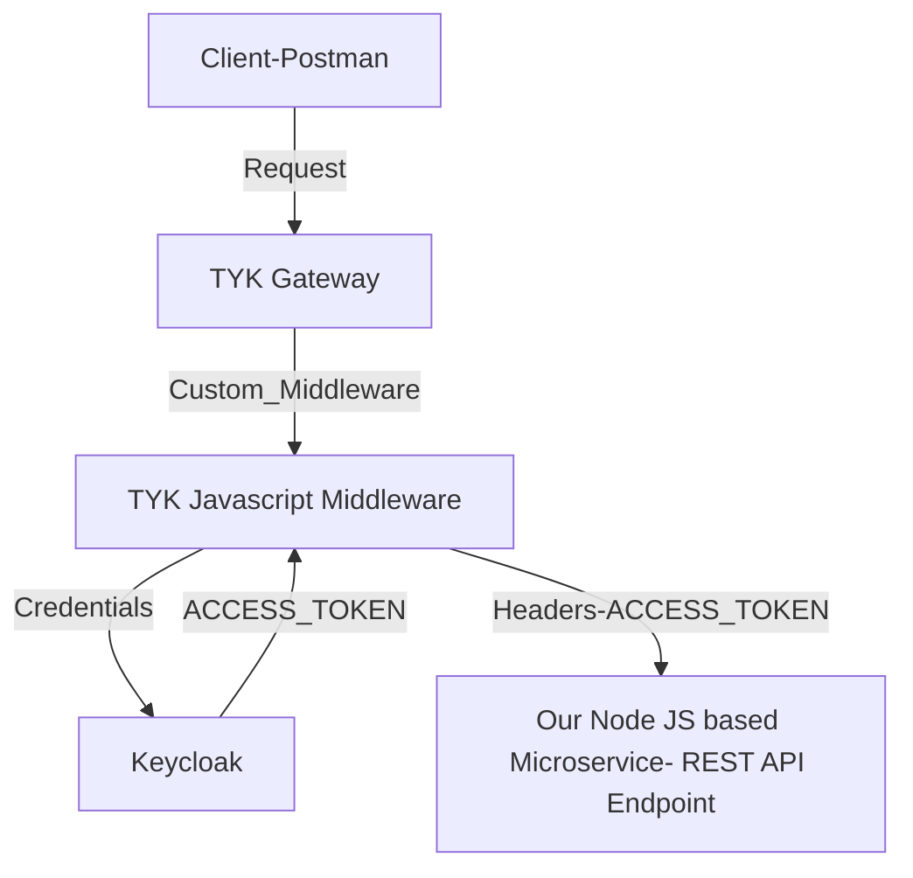

# tyk-keycloak-middleware

This is the starter for keycloak and tyk middleware using Javascript

### Create Middleware

An object of middleware is created by calling the `TykJS.TykMiddleware.NewMiddleware({})` constructor and then initializing it with your function using the `NewProcessRequest()` closure syntax.

### Create API

```
{
    "name": "web",
    "slug": "web",
    "api_id": "web",
    "org_id": "web",
    "definition": {
        "location": "header",
        "key": "version"
    },
    "use_keyless": true,
    "version_data": {
        "not_versioned": true,
        "versions": {
            "Default": {
                "name": "Default"
            }
        }
    },
    "config_data": {
        "KC_CLIENT_ID": "backend-app-client",
        "KC_REALM": "tyk",
        "KC_GRANT_TYPE": "client_credentials",
        "KC_SECRET": "iimAz1Pnq9zbzVvLVbbTlc5qJLJ46OLh",
        "KC_SERVER": "http://oidc:8080"
    },
    "custom_middleware": {
        "pre": [
            {
                "name": "auth",
                "path": "/opt/tyk-gateway/middleware/auth.js",
                "require_session": false,
                "raw_body_only": false
            }
        ]
    },
    "driver": "otto",
    "proxy": {
        "listen_path": "/web",
        "target_url": "http://host.docker.internal:3146/web",
        "strip_listen_path": true
    }
}
```
### Flow




