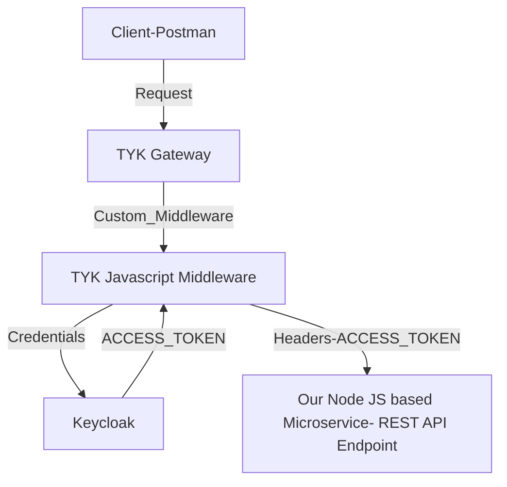

# tyk-keycloak-middleware

This is the starter for keycloak and tyk middleware using Javascript

## Flow

```mermaid
  flowchart TD;
    A[Client-Postman]--Request-->B[TYK Gateway];
    B[TYK Gateway]--Custom_Middleware-->C[TYK Javascript Middleware]
    C[TYK Javascript Middleware]--Credentials-->D[Keycloak]
    D[Keycloak]--ACCESS_TOKEN-->C[TYK Javascript Middleware]
    C[TYK Javascript Middleware]--Headers-ACCESS_TOKEN-->E[Our Node JS based Microservice- REST API Endpoint]
```
